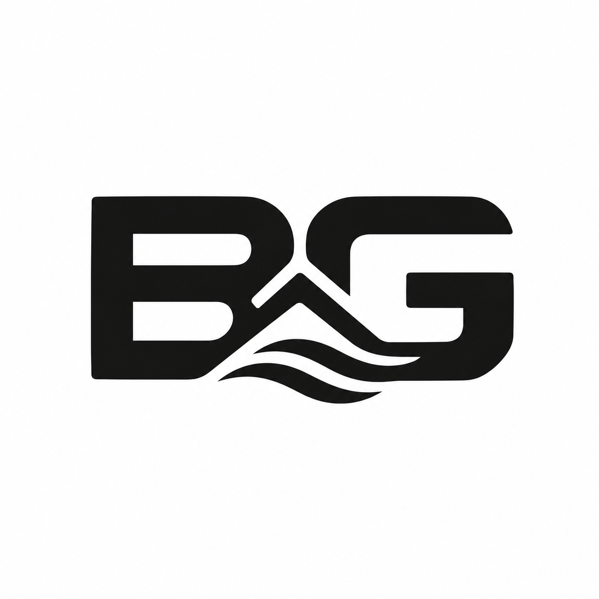

    

    

    # BG TECH LABS

    ### SOFTWARE DEVELOPMENT & DIGITAL SOLUTIONS

    

    ---

    | **INVOICE** | |
    |---|---:|
    | **Invoice number** | BGT-2026-0930-001 |
    | **Issue date** | 30 September 2026 |
    | **Due date** | 14 October 2026 |
    | **Currency** | USD |

    ## From

    **BG Tech Labs**  
    337 Robert Mugabe Way  
    Masvingo, Zimbabwe

    ## Bill To

    **Brilliant Chemicals (Pvt) Ltd**  
    1225 16th Road, Tynwald Industries  
    Tynwald South, Harare, Zimbabwe  
    Email: sales@brilliantchemicals.co.zw  
    Telephone: +263 772 801 892 / +263 737 066 415

    ## Professional Services

    | # | Description | Deliverable | Amount (USD) |
    |---:|---|---|---:|
    | 1 | Business requirements and workflow analysis | Requirements review, workflow definition, and technical implementation plan | $55.00 |
    | 2 | User experience and interface design | Responsive screen layouts, reusable interface components, and interaction states | $75.00 |
    | 3 | Front-end feature development | Production-ready responsive feature implementation with validation and error handling | $140.00 |
    | 4 | Data integration and configuration | Data-field mapping, application configuration, and integration into the existing workflow | $50.00 |
    | 5 | Quality assurance and deployment handover | Functional testing, defect resolution, deployment preparation, and handover notes | $30.00 |
    |  |  | **Subtotal** | **$350.00** |
    |  |  | **Tax/VAT** | **Not charged** |
    |  |  | **TOTAL DUE** | **$350.00** |

    ## Scope and Delivery

    The fee covers the software development services and deliverables listed above. Work outside this scope, third-party subscriptions, hosting charges, domain fees, paid APIs, and additional change requests are excluded unless approved separately in writing.

    ## Payment Terms

    - Payment is due by **14 October 2026**.
    - Please use invoice number **BGT-2026-0930-001** as the payment reference.
    - Payment details will be supplied by BG Tech Labs through the agreed business communication channel.
    - Any requested scope changes may require a revised quotation or separate invoice.

    ## Notes

    Thank you for choosing BG Tech Labs. We appreciate the opportunity to provide professional software development and digital solutions to Brilliant Chemicals (Pvt) Ltd.

    ---

    

    **BG Tech Labs** · 337 Robert Mugabe Way · Masvingo, Zimbabwe

    

